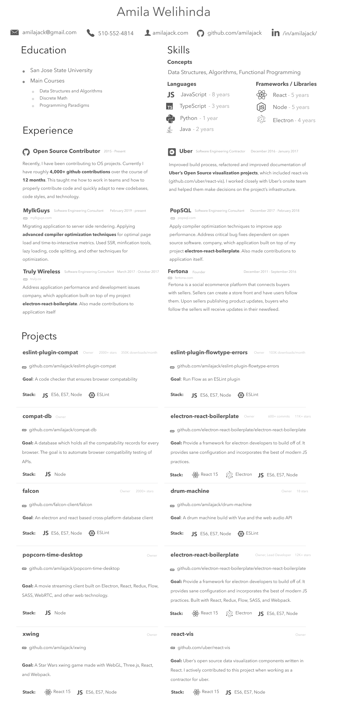

## Resume

My resume

### Local Setup

If you'd like to edit the resume, open the `Resume.fig` file with [figma](http://figma.com). You'll need to extract and install the fonts in `fonts.zip` to use the correct fonts.
